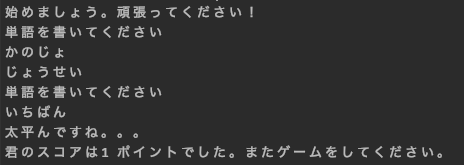

# しりとりゲーム (shiritori game)

Creating a simple game to practice learning python. The rules can be 
found [here](https://en.wikipedia.org/wiki/Shiritori)

I'm starting with a very simple hard-coded example just to demonstrate how it is 
supposed to go. Soon, I will update it so that you can actually play.

### Example flow

